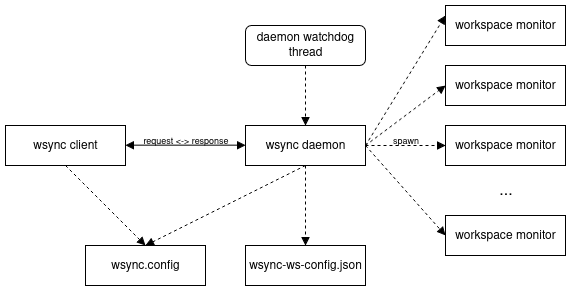

# wsync

`wsync` provides real-time synchronization of local directories (workspaces) across multiple remote systems. It ensures
that changes in a workspace managed by `wsync`, such as file/directory creation, modification or deletion, are automatically mirrored to all configured
remote systems.

## Prerequisites

--------------------------

To install and run `wsync` on your machine, the following programs need to be installed and in your system's PATH:

- `cargo`: Rust's package manager
- `rsync`: remote and local file-copying tool famous for its delta-transfer algorithm


## How to use

--------------------------

Before you can start to use `wsync`, you must complete some mandatory setup steps. To simplify this, a setup bash-script
is provided that automates those steps.

However, if you want to perform the setup steps manually, do the following:

1. Firstly, create the `.wsync` folder in your home directory


2. Inside that `.wsync` folder, create the `wsync.config` file.

    The `wsync.config` file contains key-value pairs that provide configuration information to both the `wsync`
        daemon and client. The following keys are contained:
    - `WorkspaceConfigFilePath` ... Path to a JSON file storing information about all workspaces managed by `wsync`
    - `MonitorExecutablePath` ... Path to the executable that monitors a managed workspace for filesystem changes
    - `DaemonCommandSocketPath` ... Path to the UNIX socket on which the daemon listens for commands
    - `LogDirectory` ... Path to the directory in which the daemon and the monitors store their logs


3. Ensure that the workspace configuration JSON file exists and is initialized to an empty array.
   (e.g. run ```echo "[]" >> $PATH_TO_WORKSPACE_CONFIG_FILE```)


4. Build all library and binary crates


5. Make sure that the directory with the created executables is in your system's PATH.
   (e.g. add ```export PATH="$PATH_TO_DIR_WITH_EXECUTABLES:$PATH"``` to your shell configuration file)

## Architecture

--------------------------



#### daemon

The daemon is the central process that manages and coordinates all involved components. It maintains the
`wsync-ws-config.json` configuration file and spawns a dedicated monitor process for each configured workspace. In
addition, it exposes an API that allows a client to:

1. Add or remove workspaces
2. Attach or detach remote workspaces to/from a local workspace
3. Query and display information about currently managed workspaces

#### client

The provided client implementation is a command-line tool that communicates with the daemon through its API. It provdes
a simple way to manage workspaces.

#### daemon watchdog

The watchdog supervises the state of the daemon and its resources:

1. It periodically checks if a daemon thread has panicked while holding the lock for the daemon's internal state. If
   detected, the daemon is terminated, since reliable recovery is not possible.
2. It periodically checks whether any monitor process spawned by the daemon has crashed. If detected, a crashed monitor
   is restarted, until the number of restarts exceeds a certain threshold, in which case no further restart attempts
   are made for this monitor.

#### monitor

For each managed workspace, a separate monitor process is spawned. The monitor listens for file system events in its
workspace and mirrors detected changes to all attached remote workspaces.
